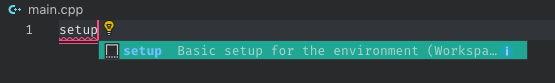
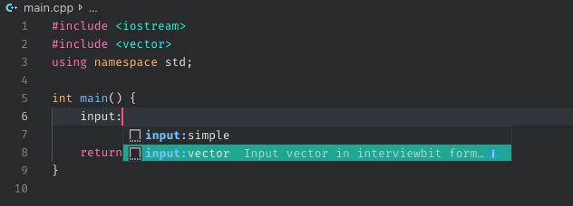
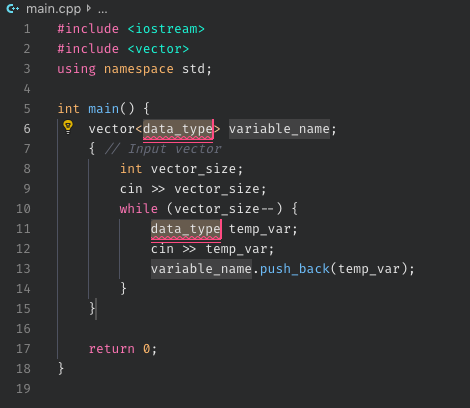
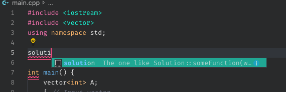
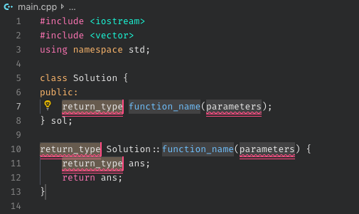
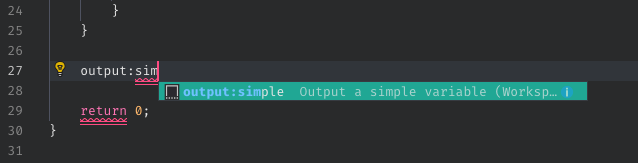
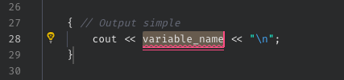

# interviewbit-vscode

> Snippets and Environment setup for VSCode while practicing competitive programming on InterviewBit.
>
> Sorry but it's only `C++`.

## Get Started

Say you're solving the question: https://www.interviewbit.com/problems/best-time-to-buy-and-sell-stocks-ii/

1. Delete everything from `main.cpp` and use the `setup` snippet:

    

    And it will basically add the basic syntax for all the programs (see [`main.cpp`](./main.cpp)).
    It will look something like this:

    ```cpp
    #include <iostream>
    #include <vector>
    using namespace std;

    int main() {
        return 0;
    }
    ```

1. The input you require is a `vector<int>`. Use the `input:vector` snippet for taking the input inside `main` function.

    

    

    Enter the `data_type` (here `int`) and `variable_name` and you're ready to go. The main function should look something like this:

    ```cpp
    int main() {
        vector<int> A;
        { // Input vector
            int vector_size;
            cin >> vector_size;
            while (vector_size--) {
                int temp_var;
                cin >> temp_var;
                A.push_back(temp_var);
            }
        }

        return 0;
    }
    ```

1. The function where you need to write solution is called `maxProfit` and it's a method of the `Solution` class. No worries! We have the `solution` snippet just for that!

    

    

    Set the `return_type` to `int`, `function_name` to `maxProfit` and parameters as `const vector<int> &A`. You'll get the following result:

    ```cpp
    class Solution {
    public:
        int maxProfit(const vector<int> &A);
    } sol;

    int Solution::maxProfit(const vector<int> &A) {
        int ans;
        return ans;
    }
    ```

    See the `sol` instance? We'll use this to access methods like the `maxProfit` here.

1. Last but not the least, add output to view the solution. Since the return type of the solution here is `int` the output is simple, literally! Use the `output:simple` snippet.

    

    

    Now, set the `variable_name` to the output you want, in this case -- `sol.maxProfit(A)`.

1. Now write your solution like you would in interviewbit and just copy-paste your solution.

1. Run the program by simply executing the `run.sh` script.

    ```sh
    $ ./run.sh
    ```

    **NOTE** If the script doesn't have correct permissions, use the following to give it the required permissions:

    ```sh
    $ sudo chmod 755 run.sh
    ```

## Snippets

Currently the available snippets are:

* `setup`: Basic setup for the environment

* `input:simple`: Input int, string and other simple datatypes

* `input:vector`: Input vector in interviewbit format

* `output:simple`: Output a simple variable

* `output:vector`: Output a vector in a pretty format

* `solution`: The one like Solution::someFunction(with, some, parameters)

**License:** [WTFPL](./LICENSE)
